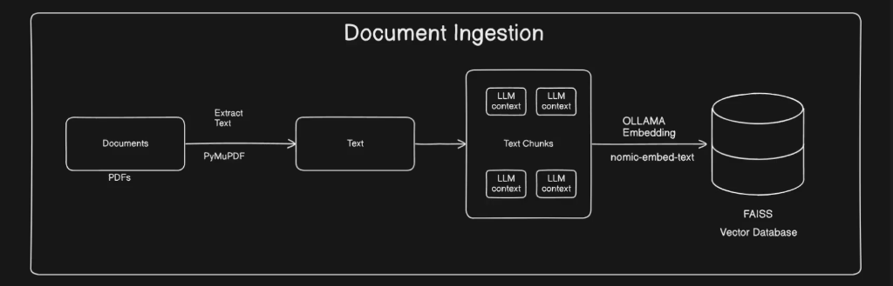
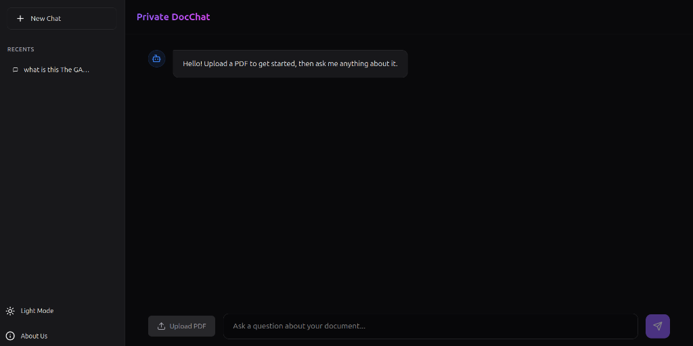

# RAG-based Document Q&A System

This project is a Retrieval-Augmented Generation (RAG) system capable of ingesting PDF documents and allowing users to query them using natural language. It leverages a modern tech stack to provide accurate, context-aware answers by retrieving relevant information from the uploaded documents.

## Architecture

The system consists of two main workflows: **Document Ingestion** and **Retrieval & Generation**.

### 1. Document Ingestion Flow
This flow handles the processing of uploaded PDF documents. It extracts text, chunks it, generates embeddings using Ollama, and stores them in a FAISS vector database.



### 2. Retrieval and Generation Flow
This flow processes user queries. It converts the query into an embedding, performs a similarity search in the FAISS database to find relevant context, and passes both the context and the query to the Llama 3.2 model to generate a final response.


### 3. Interface Preview
Here is a preview of the chat interface:




---

## Key Features
- **PDF Ingestion**: Upload and process PDF documents automatically.
- **Vector Search**: Efficient similarity search using FAISS.
- **Flexible Model Providers**: Switch between Ollama (local, free) and OpenAI (cloud-based) with a simple configuration change.
- **Provider-Specific Isolation**: Separate upload directories and vector stores for each provider - switch seamlessly without re-ingesting documents.
- **Local LLM Inference**: Uses Ollama (Llama 3.2) for privacy and offline capabilities.
- **OpenAI Integration**: Optional cloud-based models for higher quality responses.
- **Interactive Chat Interface**: A clean, responsive React-based frontend for querying documents.

---

## Tech Stack

### Backend
- **Framework**: FastAPI
- **LLM Orchestration**: LangChain
- **Vector Store**: FAISS
- **Model Providers**: 
  - **Ollama** (default): Llama 3.2 + Nomic Embed Text (100% free, local)
  - **OpenAI** (optional): GPT-3.5/GPT-4 + OpenAI Embeddings (cloud-based, requires API key)
- **PDF Processing**: PyMuPDF

### Frontend
- **Framework**: React.js
- **Build Tool**: Vite
- **Styling**: CSS Modules / Standard CSS

---

## ⚙️ Setup & Installation

### Prerequisites
- **Python** (3.10 or higher)
- **Node.js** (v16 or higher)
- **Choose your model provider**:
  - **Option 1 - Ollama** (recommended for local/free): Install Ollama locally
    - Pull the LLM model: `ollama pull llama3.2:1b`
    - Pull the embedding model: `ollama pull nomic-embed-text`
  - **Option 2 - OpenAI** (cloud-based): Get an API key from [OpenAI Platform](https://platform.openai.com/api-keys)

### 1. Backend Setup

```bash
# Navigate to the backend directory
cd backend

# Create a virtual environment
python3 -m venv venv

# Activate the virtual environment
# On Linux/macOS:
source venv/bin/activate
# On Windows:
# .\venv\Scripts\activate

# Install dependencies
pip install -r requirements.txt

# Configure model provider (optional)
# Edit backend/src/config.py and set MODEL_PROVIDER to "ollama" or "openai"
# For OpenAI: Create a .env file in backend/ with your API key:
# OPENAI_API_KEY=sk-proj-your-api-key-here

# Start the backend server
python main.py
```
*The backend will start at `http://localhost:8000`*

**📌 Model Provider Configuration:**
- By default, the system uses **Ollama** (local, free)
- To switch to **OpenAI**:
  1. Open `backend/src/config.py`
  2. Change `MODEL_PROVIDER = "ollama"` to `MODEL_PROVIDER = "openai"`
  3. Create a `.env` file in the `backend/` directory with your OpenAI API key
  4. Restart the backend server

**🗂️ Provider-Specific Storage:**
The system maintains **separate directories** for each provider:
- **Ollama**: 
  - Uploaded PDFs: `backend/uploads_ollama/`
  - Vector store: `backend/vector_store_index_ollama/`
- **OpenAI**: 
  - Uploaded PDFs: `backend/uploads_openai/`
  - Vector store: `backend/vector_store_index_openai/`

This means you can switch between providers without re-uploading documents - each provider's data persists independently!

### 2. Frontend Setup

```bash
# Navigate to the frontend directory
cd frontend

# Install dependencies
npm install

# Start the development server
npm run dev
```
*The frontend will start at `http://localhost:5173` (or similar)*

---

##  Usage
1. Open the frontend URL in any of your Preffered browser.
2. Use the **Upload** feature to ingest a PDF file.
3. Wait for the ingestion to complete (check backend logs for "Vector store created" message).
4. Type your question in the chat interface and receive answers based on the document's content.
